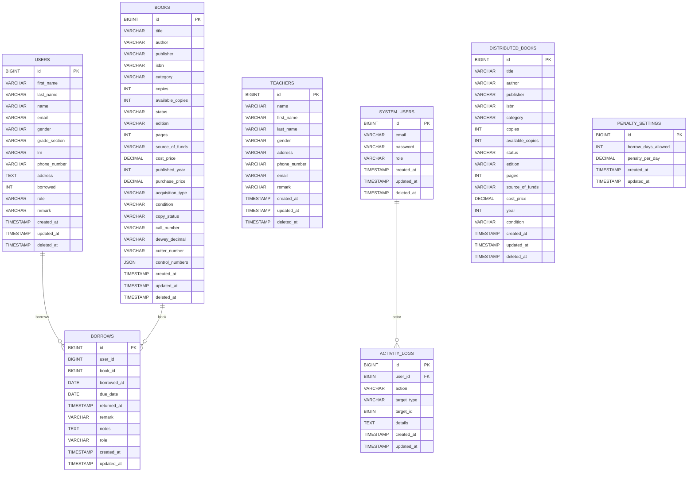

**ERD (MySQL)**

**Relationship Notes**
- `borrows.user_id` is used for both students (`users`) and teachers (`teachers`) based on role logic in controllers. The schema does not enforce a strict FK for this field.
- `borrows.book_id` points to `books` in primary flows; some distributed flows may reference `distributed_books` by ID.
- `activity_logs.user_id` references `system_users.id` via FK.

Sources: `app/Models/*`, `database/migrations/*`, `app/Http/Controllers/BorrowController.php`, `app/Http/Controllers/BookController.php`, `app/Http/Controllers/TeacherBorrowController.php`.
