**UI Flow Maps**

**Login Flow**

Sources: `routes/web.php`, `app/Http/Controllers/Auth/LoginController.php`, `resources/views/auth/login.blade.php`.

**Borrow Books Flow**

```mermaid
sequenceDiagram
  participant U as Staff
  participant B as BorrowController
  participant M as Borrow model
  participant K as Book model
  U->>B: GET /borrow/create
  B-->>U: Render borrow form
  U->>B: POST /borrow
  B->>M: Create Borrow records
  B->>K: Update book availability and status
  B-->>U: Redirect with success or warning
```

Sources: `routes/web.php`, `app/Http/Controllers/BorrowController.php`.

**Return Books Flow**

Sources: `routes/web.php`, `app/Http/Controllers/BorrowController.php`.
